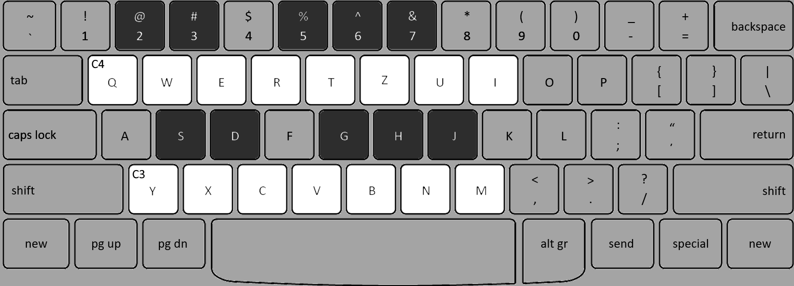

# Ableton Online (working title)

a 16-step sequencer for making beats online

## Usage

### Initialization

To be able to play sound properly resume the AudioContext by clicking the `Sound ❌` button in the top left. 
When the button changes to `Sound ✔` you can start playing.

### Using a MIDI device

If you want to use a MIDI device with the app plug your device in and refresh the page. It should be listed in the `Input` dropdown in the top right.

### Virtual Keyboard

If you don't have a MIDI device you can use your keyboard to play notes just as you would with a MIDI keyboard.

To use the virtual keyboard select it form the `Input` dropdown in the top right.

## Recording

You can record MIDI notes by clicking the record icon `⏺` at the top. A red circle indicates that it is 
armed for recording.

To record a phrase or a pattern on a chennel first select the channel you want to record by clicking on it in the
channel rack or by clicking it's corresponding track in the arrangement. The selected channel will be dimmed in the
channel rack and it's name underlined.

After selecting the channel you wish to record click the `R` button on the channel to arm it for recording as well.

Now you are ready to record. Press play and you will hear a countdown of 4 clicks before the loop starts and you
can start playing.

### Metronome

If you want to play to a click you can turn on the metronome by clicking on the `Met` button.

## Exporting

If you recorded something interesting that you wish to save you can do that by clicking the `Export` button and it will download the loop as a `.mid` file which you can play or edit later in a DAW of your choice.

## Dependencies

- WEBMIDI.js (https://webmidijs.org)
- smplr (https://github.com/danigb/smplr)
- MIDIFileWriter.js (https://github.com/metayeti/MIDIFileWriter.js)